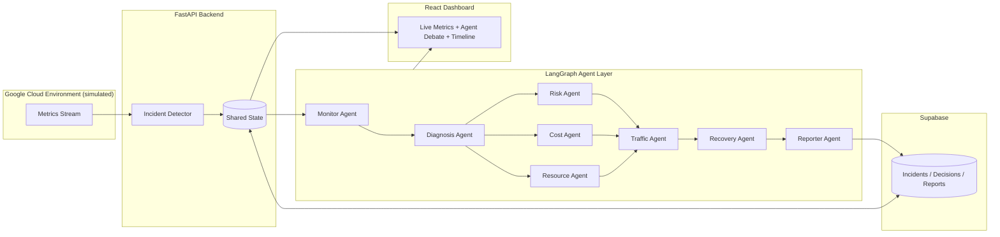

<div align="center">

# 🛰️ HIVE Nebula

### An Autonomous Multi-Agent Incident Commander for Google Cloud Infrastructure

*When servers fail at 2 AM, HIVE doesn't wait for an engineer to wake up — it plans, debates, and recovers on its own.*


</div>

---

## 📑 Table of Contents

1. [Project Title](#-hive-nebula)
2. [Team Details](#-team-details)
3. [Problem Statement](#-problem-statement)
4. [Solution Overview](#-solution-overview)
5. [Key Features](#-key-features)
6. [Tech Stack](#-tech-stack)
7. [System Architecture](#-system-architecture)
8. [Detailed Workflow](#-detailed-workflow)
9. [AI/ML Workflow](#-aiml-workflow)
10. [Folder Structure](#-folder-structure)
11. [Installation Guide](#-installation-guide)
12. [Usage Guide](#-usage-guide)
13. [API Documentation](#-api-documentation)
14. [Security Measures](#-security-measures)
15. [Testing & Performance](#-testing--performance)
16. [Challenges Faced](#-challenges-faced)
17. [Future Scope](#-future-scope)
18. [Demo](#-demo)
19. [References](#-references)

> Sections 9, 14, and 15 are owned by other teammates and are stubbed below so the document reads as one coherent file — fill them in as those parts land.

---

## 👥 Team Details
| _Member 1_ |THASLIMA NASREEN J|
| _Member 2_ |THAMARAI V |
| _Member 3_ | RIHIKA K |


##  Problem Statement

### Background
Modern cloud platforms (AWS, Azure, Google Cloud) run thousands of interdependent services. A single failure — a memory leak, a crashed container, a saturated network link — can cascade into an outage affecting thousands of users within minutes. Cloud providers invest heavily in monitoring, but **monitoring is not the same as recovery**.

### Current Challenges
- **Manual coordination** — incidents are triaged by on-call engineers who must correlate alerts, diagnose root cause, and decide on a fix, often at odd hours.
- **Alert fatigue** — a single incident can trigger dozens of overlapping alerts across different subsystems, making it hard to see the actual root cause.
- **Slow recovery** — the gap between "alert fired" and "service restored" is dominated by human investigation time, not by the actual fix.
- **Human dependency** — recovery quality depends on which engineer is on call and how experienced they are with that specific failure mode.

### Gap
Existing observability tools (Prometheus, Datadog, Cloud Monitoring, etc.) are excellent at **detecting** anomalies but stop short of **deciding and acting**. They surface a dashboard full of red numbers and leave the reasoning and the recovery entirely to a human.

### Objective
Build an autonomous AI workforce — a set of specialized, cooperating agents — that can:
1. Detect an incident from live infrastructure metrics.
2. Diagnose the likely root cause.
3. Debate and weigh trade-offs (cost, risk, downtime) between possible recovery strategies.
4. Execute the chosen recovery action.
5. Report a clear, human-readable root-cause summary — all without waking anyone up.

---

## 💡 Solution Overview

**HIVE Nebula** is a multi-agent orchestration platform that continuously monitors a Google Cloud environment, detects incidents in real time, and lets a team of specialized AI agents collaboratively decide the optimal recovery strategy — then executes that recovery automatically.

Instead of a single model making a black-box decision, HIVE splits reasoning across role-specific agents (Monitoring, Diagnosis, Resource, Cost, Risk, Traffic, Recovery, and Reporting) that **converse with each other** the way a real incident-response team would — proposing actions, raising cost or risk objections, and reaching a consensus — before anything is executed on the infrastructure.

The result is a **living dashboard**: no chatbot box, no manual clicks. You inject a failure, and you watch the agents notice it, argue about the best fix, act on it, and explain what happened afterward.

```
Cloud Metrics → Incident Detection → Agent Debate → Consensus Plan → Automated Recovery → Root-Cause Report
```

**Scope note:** the current prototype targets **Google Cloud** specifically (chosen for its strong native AI/monitoring APIs and to keep the 24-hour build focused). The orchestration engine itself is provider-agnostic — extending it to AWS or Azure is future scope, not a current claim.

---

## ⭐ Key Features

| Feature | Purpose | Why It Matters |
|---|---|---|
| **Incident Detection** | Continuously watches cloud metrics (CPU, memory, network, error rates) to flag abnormal behavior. | Catches failures the moment they start, not after users complain. |
| **AI Debate Engine** | Specialized agents independently analyze an incident and argue toward a consensus, instead of one model deciding alone. | Improves decision quality, transparency, and makes the reasoning auditable. |
| **Dependency Analysis** | Maps which services and containers are affected downstream of a failing component. | Prevents recovery actions that fix one thing and silently break another. |
| **Recovery Planning** | Converts the agreed-upon strategy into a concrete, ordered set of recovery actions. | Turns discussion into execution, closing the loop without human intervention. |
| **Root Cause Report** | Automatically generates a plain-language incident summary after recovery. | Gives on-call teams a postmortem instantly, instead of hours of manual log digging. |
| **Live Dashboard** | Real-time visualization of servers, agent conversations, and the recovery timeline. | Makes autonomous behavior visible and demonstrable, not a black box. |

---

## 🛠️ Tech Stack

| Layer | Technology | Purpose |
|---|---|---|
| Frontend | React | Live incident dashboard |
| Styling | Tailwind CSS | UI design system |
| Backend | FastAPI | REST APIs, orchestration entry points |
| AI Reasoning | Gemini | Per-agent reasoning and debate generation |
| Agent Framework | LangGraph | Multi-agent orchestration and state management |
| Database | Supabase | Persisting incidents, agent decisions, reports |
| Visualization | React Flow | Agent/dependency graph rendering |
| Charts | Recharts | Live metrics (CPU, memory, network) |

---

## 🏗️ System Architecture

> Placeholder — swap this for the final exported architecture diagram (image or draw.io/Mermaid export) once it's designed. Kept here as a text version so the section isn't empty in the meantime.



**Component roles:**
- **Incident Detector** — ingests live/simulated metrics and flags anomalies.
- **Shared State** — the common blackboard all agents read from and write to.
- **Agent Layer** — each agent has one job and one voice in the debate; the Planner/Reporter agents synthesize the final decision and summary.
- **Supabase** — durable store for every incident, the agent debate transcript, and the resulting report.
- **Dashboard** — renders servers, live agent messages, and the recovery timeline with zero manual clicks.

---

## 🔄 Detailed Workflow

1. **Cloud metrics are received** — CPU, memory, network, and error-rate signals stream (or are simulated via a "Inject Chaos" trigger) into the backend.
2. **Monitor Agent detects anomalies** — flags the metric that crossed a threshold (e.g., CPU at 98%).
3. **Dependency Agent identifies impacted services** — maps which downstream containers/services are affected.
4. **Specialized AI agents independently analyze the incident** — Diagnosis, Cost, Risk, and Traffic agents each reason about the situation from their own angle.
5. **Agents debate** — e.g., Resource proposes a new container, Cost flags the hourly price, Risk estimates downtime probability, Traffic proposes shifting load.
6. **Planner Agent reaches a consensus** — weighs the trade-offs raised in the debate and picks one recovery strategy.
7. **Recovery Agent executes the selected strategy** — spins up resources, restarts services, or reroutes traffic as decided.
8. **Reporter Agent generates the incident report** — a root-cause summary written in plain language, stored alongside the full debate transcript.

```
Cloud Metrics
      │
      ▼
Incident Detection (Monitor Agent)
      │
      ▼
Dependency Analysis
      │
      ▼
Agent Debate (Diagnosis · Cost · Risk · Traffic)
      │
      ▼
Consensus Plan (Planner Agent)
      │
      ▼
Automated Recovery (Recovery Agent)
      │
      ▼
Root-Cause Report (Reporter Agent)
```

---
## 🧠 AI/ML Workflow

> Section owned by another teammate — stubbed here so the document reads as one coherent file. Fill in with the agent prompting strategy, model configuration, and reasoning pipeline details as that part lands.

---

## 📁 Folder Structure

```
hive-nebula/
├── frontend/                   # React + Tailwind CSS client application
│   ├── src/
│   │   ├── components/         # Reusable UI components (dashboard widgets, graphs, panels)
│   │   ├── flows/               # React Flow definitions for dependency and agent graphs
│   │   ├── pages/               # Route-level views (Dashboard, Incident Detail, Reports)
│   │   ├── charts/               # Recharts-based visualizations (latency, throughput, health)
│   │   ├── hooks/                # Custom React hooks for state and data fetching
│   │   ├── utils/                # Formatting, API clients, constants
│   │   └── assets/               # Icons, images, and static design assets
│   ├── public/
│   └── package.json
│
├── backend/                     # FastAPI application server
│   ├── api/                      # Route definitions and request/response schemas
│   │   ├── routes/               # Endpoint modules (chaos, state, debate, plan, report)
│   │   └── schemas/               # Pydantic models
│   ├── core/                     # Application configuration and startup logic
│   ├── services/                  # Business logic bridging API and agent layer
│   ├── storage/                    # Shared memory state management (prototype persistence)
│   └── main.py                     # FastAPI application entrypoint
│
├── agents/                        # LangGraph multi-agent orchestration layer
│   ├── monitor_agent/               # Anomaly detection and telemetry ingestion
│   ├── dependency_agent/            # Service dependency graph analysis
│   ├── planner_agent/               # Recovery strategy proposal and coordination
│   ├── risk_agent/                  # Risk scoring and impact assessment
│   ├── resource_agent/              # Resource availability and constraint evaluation
│   ├── recovery_agent/              # Recovery action execution
│   ├── documentation_agent/         # Root Cause Analysis report generation
│   └── graph.py                     # LangGraph orchestration graph definition
│
├── utils/                          # Shared utilities used across backend and agents
│   ├── telemetry_simulator.py        # Cloud Digital Twin telemetry generator
│   └── logger.py
│
├── assets/                          # Repository-level media (diagrams, screenshots, demo assets)
│
├── .env.example
├── requirements.txt
└── README.md
```

---

## ⚙️ Installation Guide

### Clone Repository

```bash
git clone https://github.com/Rithika0718/Rush24-HiVe.git
cd Rush24-HiVe
```

### Frontend Setup

```bash
cd frontend
npm install
```

### Backend Setup

```bash
cd backend
python -m venv venv
source venv/bin/activate   # On Windows: venv\Scripts\activate
pip install -r requirements.txt
```

### Environment Variables

Create a `.env` file in the `backend/` directory:

```env
GEMINI_API_KEY=your_gemini_api_key
BACKEND_PORT=8000
FRONTEND_ORIGIN=http://localhost:3000
LOG_LEVEL=info
```

Create a `.env` file in the `frontend/` directory:

```env
VITE_API_BASE_URL=http://localhost:8000
```

### Run Frontend

```bash
cd frontend
npm run dev
```

### Run Backend

```bash
cd backend
uvicorn main:app --reload --port 8000
```

---

## 🧭 Usage Guide

1. **Open Dashboard** — Launch the frontend to view the live Cloud Digital Twin, service topology, and system health metrics.
2. **Inject Incident** — Trigger a simulated incident (e.g., abnormal database latency) via the dashboard control panel.
3. **Monitor Agent Detects Anomaly** — The Monitor Agent ingests telemetry and flags the deviation, initiating the incident workflow.
4. **Dependency Analysis** — The Dependency Agent maps affected downstream services using the live topology graph.
5. **AI Agents Debate** — The Risk, Resource, and Planner Agents evaluate multiple recovery strategies, weighing trade-offs in real time.
6. **Planner Selects Strategy** — Consensus is reached, and the Planner Agent finalizes the optimal recovery plan.
7. **Recovery Executes** — The Recovery Agent orchestrates the selected remediation actions against the affected services.
8. **Dashboard Updates** — The frontend reflects real-time state changes as services recover.
9. **Root Cause Report Generated** — The Documentation Agent compiles a structured RCA report summarizing the incident timeline, decision rationale, and resolution steps.

---

## 🔌 API Documentation

| Method | Endpoint             | Description                                                            |
|--------|-----------------------|-------------------------------------------------------------------------|
| POST   | `/inject-chaos`       | Injects a simulated incident (e.g., latency spike) into the Cloud Digital Twin. |
| GET    | `/system-state`       | Returns the current state of all monitored services and dependencies.  |
| GET    | `/agent-debate`       | Returns the live reasoning trace and strategy evaluation from the agent debate. |
| POST   | `/execute-plan`       | Executes the recovery plan selected by the Planner Agent.               |
| GET    | `/incident-report`    | Retrieves the generated Root Cause Analysis report for a given incident. |

---

## 🔒 Security Measures

> Section owned by another teammate — stubbed here so the document reads as one coherent file. Fill in with authentication, input validation, and data-handling details as that part lands.

---

## 🧪 Testing & Performance

> Section owned by another teammate — stubbed here so the document reads as one coherent file. Fill in with test coverage, load-testing results, and latency benchmarks as that part lands.

---

## 🧩 Challenges Faced

- **Multi-agent communication** — Coordinating message passing and shared context across seven specialized agents without introducing race conditions or conflicting state writes.
- **Shared memory synchronization** — Ensuring consistent read/write access to the prototype's in-memory state store under concurrent agent execution.
- **Consensus generation** — Designing a debate protocol that allows agents with competing objectives (risk minimization vs. recovery speed) to converge on a single actionable strategy.
- **Cloud telemetry simulation** — Building a realistic Cloud Digital Twin capable of producing believable cascading failure patterns for demonstration purposes.
- **Prompt engineering** — Tuning agent prompts to produce structured, deterministic outputs suitable for programmatic orchestration rather than free-form text.
- **Real-time state updates** — Synchronizing backend state transitions with frontend visualizations without introducing latency or stale renders.
- **Limited development time** — Balancing architectural completeness with the constraints of a fixed build window.

---

## 🚀 Future Scope

### Technical Enhancements

- Redis-backed state management for distributed, low-latency shared memory
- Kafka-based event streaming for agent communication and telemetry ingestion
- Kubernetes-native deployment for production-grade orchestration and scaling
- Enterprise authentication (SSO, RBAC) for multi-tenant environments
- Cross-cloud orchestration spanning AWS, Azure, and GCP
- Continuous learning pipeline to refine agent decision-making from historical incidents

### Business Expansion

- **Healthcare** — Incident response for clinical infrastructure and patient-data systems
- **Manufacturing** — Autonomous recovery for industrial control and IoT networks
- **Government Infrastructure** — Resilience orchestration for public sector cloud systems
- **Financial Services** — Incident management for transaction-critical platforms
- **Smart Cities** — Coordinated recovery across interconnected municipal systems

---

## 🎬 Demo

| Asset                  | Preview                                      |
|------------------------|-----------------------------------------------|
| Dashboard Screenshot    | `assets/dashboard-screenshot.png`             |
| Incident Detection      | `assets/incident-detection.png`               |
| AI Debate               | `assets/ai-debate.png`                        |
| Recovery Execution      | `assets/recovery-execution.png`               |
| Root Cause Analysis     | `assets/root-cause-analysis.png`              |
| Demo Video              | [Watch Demo](https://your-demo-video-link)    |
| Live Deployment         | [Live App](https://your-deployment-link)      |
| GitHub Repository       | [Source Code](https://github.com/Rithika0718/Rush24-HiVe) |

---

## 📚 References

- [React Documentation](https://react.dev)
- [FastAPI Documentation](https://fastapi.tiangolo.com)
- [Tailwind CSS Documentation](https://tailwindcss.com/docs)
- [LangGraph Documentation](https://langchain-ai.github.io/langgraph/)
- [Gemini API Documentation](https://ai.google.dev/gemini-api/docs)
- [Google Cloud Monitoring Documentation](https://cloud.google.com/monitoring/docs)
- [AWS CloudWatch Documentation](https://docs.aws.amazon.com/cloudwatch/)
- [Azure Monitor Documentation](https://learn.microsoft.com/en-us/azure/azure-monitor/)
- [Render Documentation](https://render.com/docs)
- [Vercel Documentation](https://vercel.com/docs)
- [Supabase Documentation](https://supabase.com/docs)

---

## 📄 License

This project is licensed under the MIT License.

```
MIT License

Copyright (c) 2026 HIVE Nebula Contributors

Permission is hereby granted, free of charge, to any person obtaining a copy
of this software and associated documentation files (the "Software"), to deal
in the Software without restriction, including without limitation the rights
to use, copy, modify, merge, publish, distribute, sublicense, and/or sell
copies of the Software, and to permit persons to whom the Software is
furnished to do so, subject to the following conditions:

The above copyright notice and this permission notice shall be included in all
copies or substantial portions of the Software.

THE SOFTWARE IS PROVIDED "AS IS", WITHOUT WARRANTY OF ANY KIND, EXPRESS OR
IMPLIED, INCLUDING BUT NOT LIMITED TO THE WARRANTIES OF MERCHANTABILITY,
FITNESS FOR A PARTICULAR PURPOSE AND NONINFRINGEMENT. IN NO EVENT SHALL THE
AUTHORS OR COPYRIGHT HOLDERS BE LIABLE FOR ANY CLAIM, DAMAGES OR OTHER
LIABILITY, WHETHER IN AN ACTION OF CONTRACT, TORT OR OTHERWISE, ARISING FROM,
OUT OF OR IN CONNECTION WITH THE SOFTWARE OR THE USE OR OTHER DEALINGS IN THE
SOFTWARE.
```


<div align="center">

*Built for [RUSH24HOUR] — 2026*

</div>
